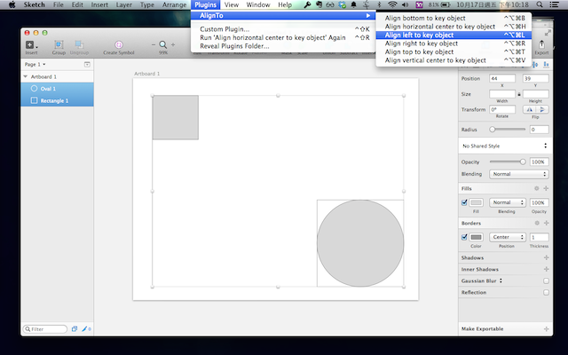
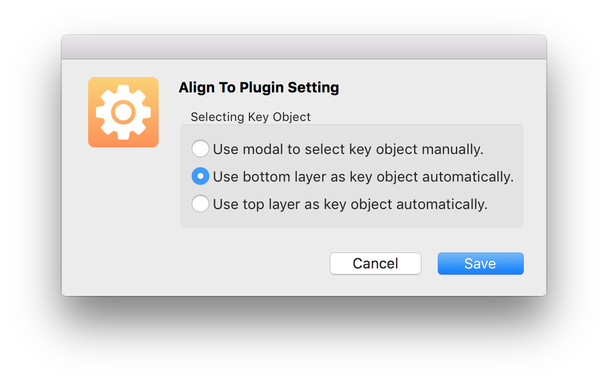
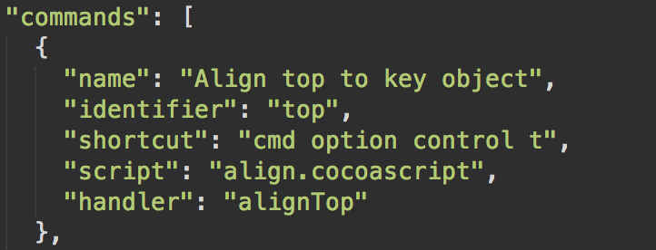

Align To
=================

Plugin that align object relative to more options for Bohemian Coding's Sketch 3.
It provides that align relative to key object in Sketch 3.

Because original align function in Sketch only provide that align to a selection and an Artboard, this plugin port illustrator's function of align to key objects.

#DEMO Video

#Feature

- Align left relative to key object
- Align right relative to key object
- Align top relative to key object
- Align bottom relative to key object
- Align horzonial center relative to key object
- Align vertical center relative to key object
- Align horzonial and vertical center relative to key object
- Align layers automactically with bottom or top layer of a group layers

#Installation

###Intall by Sketch Toolbox (recommended)
Use [Sketch Toolbox](http://sketchtoolbox.com/) to search `AlignTo` and click install.

###Install manually 

1. [Download the latest release](https://github.com/lucienlee/AlignTo/releases/latest) and open it
2. Navigate the Sketch menu bar to `Plugins ▸ Reveal Plugins Folder`
3. Place `AlignTo` directory into the revealed plugins directory

#How to use

Select all layers you want to align, then select `Plugins ▸ AlignTo` in the Sketch menu bar. Next, select align method and which layer as key layer.

### Setting
You can choose how "Align To" select the key object in Setting.  
Align To provide three modes to select the key object, which are **selecting manually**, **selecting the bottom layer automatically** and **selecting the top layer automatically**. The default setting is using modal to select key object manually. 

To change the setting, select `Plugins ▸ AlignTo ▸ Setting` in the Sketch menu bar. 

###Keyboard Shortcut

- Align left relative to key object: `CMD` + `Option` + `Ctrl` + `l`
- Align right relative to key object: `CMD` + `Option` + `Ctrl` + `r`
- Align top relative to key object: `CMD` + `Option` + `Ctrl` + `t`
- Align bottom relative to key object: `CMD` + `Option` + `Ctrl` + `b`
- Align horzonial center relative to key object: `CMD` + `Option` + `Ctrl` + `h`
- Align vertical center relative to key object: `CMD` + `Option` + `Ctrl` + `v`
- Align vertical and horzonial center relative to key object: `CMD` + `Option` + `Ctrl` + `a`

###Change Shortcut
Open `AlignTo` directory, then open `manifest.json` file with text editor. Change shortcut you want in the command lists.

#Credits
Thanks [@romannurik](https://github.com/romannurik) and [@abynim](https://github.com/abynim) 's plugins to make this plugin possible.

- [SketchPlugin Remember](https://github.com/abynim/SketchPlugin-Remember)
- [Sketch Nib UI Template Plugin](https://github.com/romannurik/Sketch-NibUITemplatePlugin)

#Feedback

If you discover any issues or have questions regarding usage, please send a message to [lucien@lucienlee.cc](mailto:lucien@lucienlee.cc)
